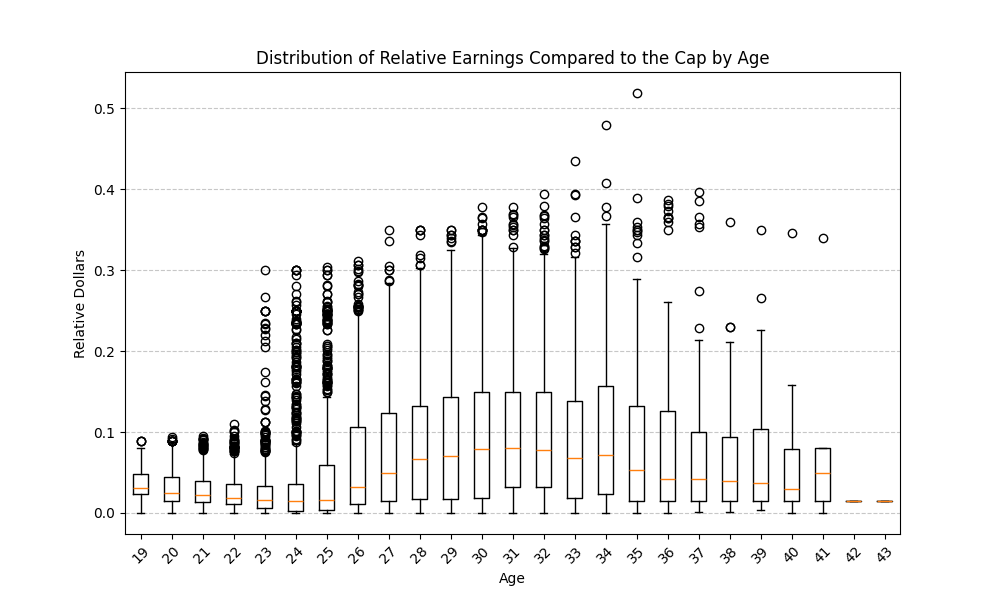

# MSIM 780: NBA Athlete Value Predictor 
_Liam Whitenack, February 10th, 2026_

## Abstract

Within the current NBA landscape, monetary roster flexibility has become more crucial to manage efficiently than ever before. Given the league's newest Collective Bargaining Agreement (CBA) rules, it is essential that front offices accurately forecast a player's market value. This tool will use the precedent for a player compared to their historical equivalents to predict the market cost of a player. This tool could be used to predict the longevity of a player's career, the value of their contributions, or even college players before they enter the draft. The data, accumulated via APIs on nba.com, spotrac.com, and tankathon.com, has been painstakingly organized within a private repository. This data will present some difficulty in predicting future values in that it will require an ensemble of different models. One model will need to be used to project how much longer a player will remain in the NBA, while another will calculate their market value given their statistical contributions. A third model will be used to estimate the totality of the player's earnings using either their pre-draft information or their current statistics. 

